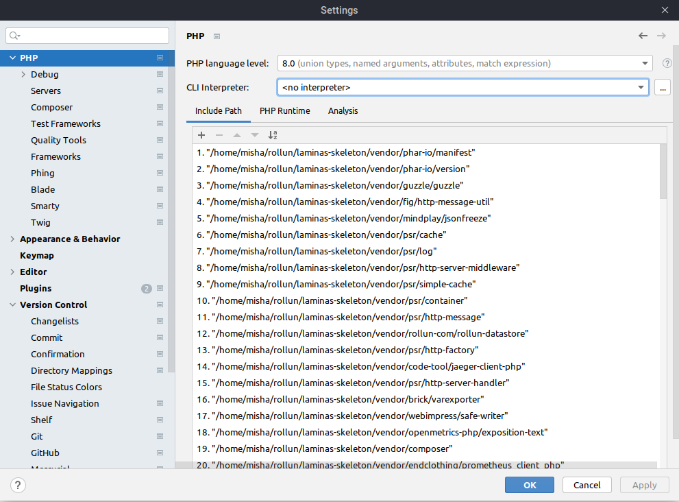
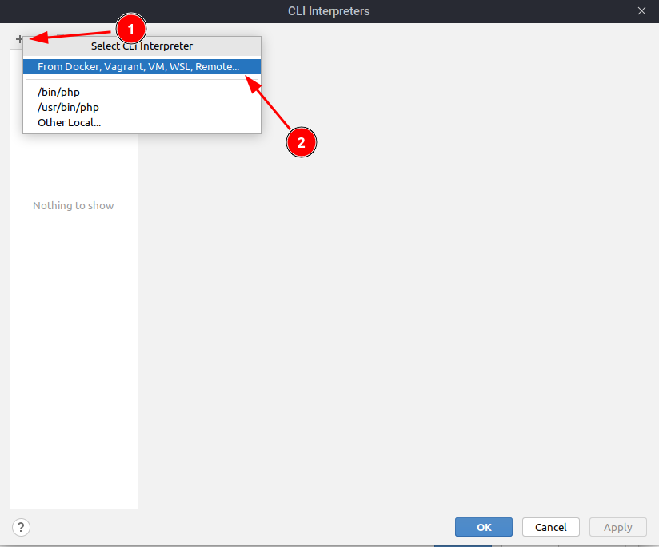
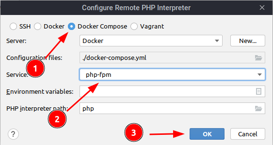
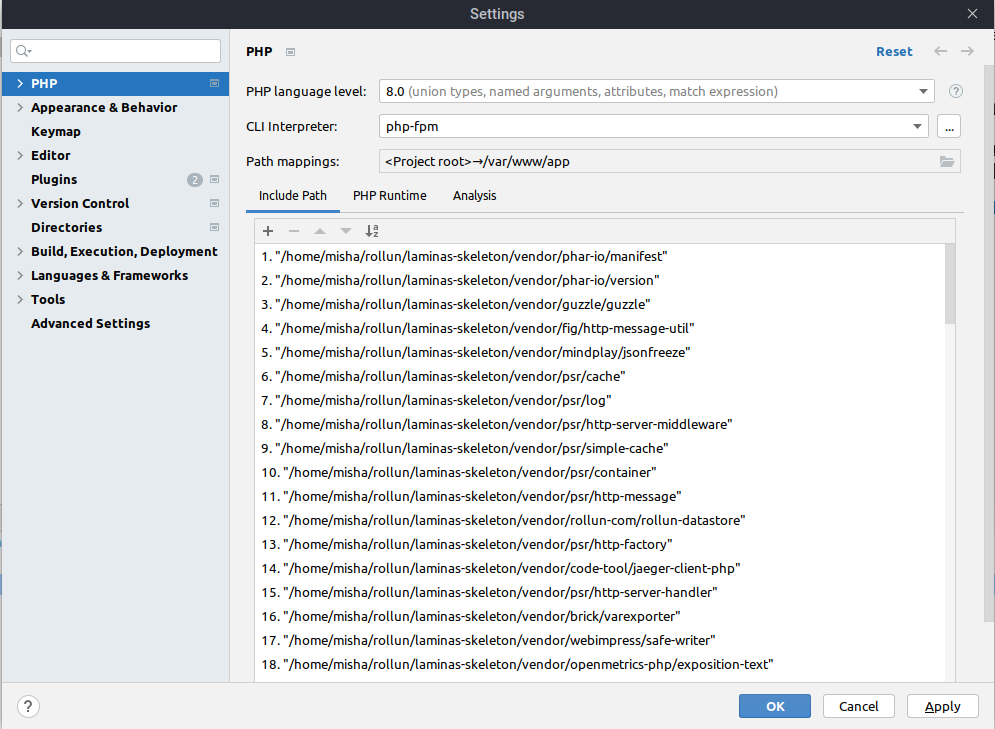
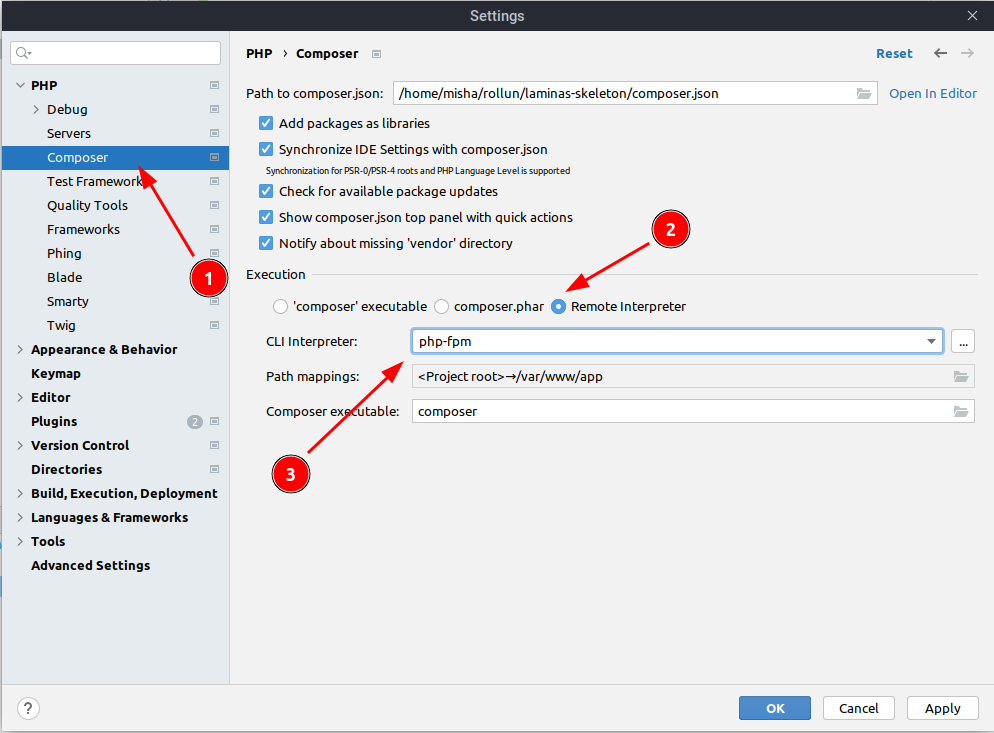
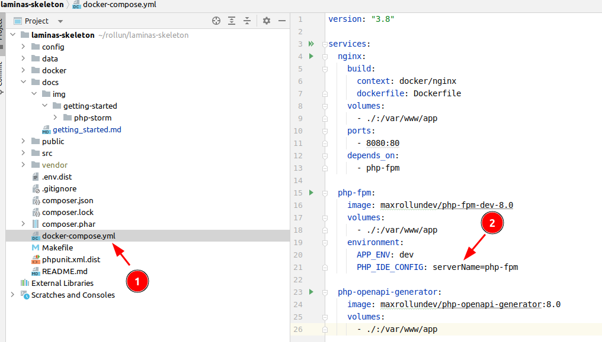
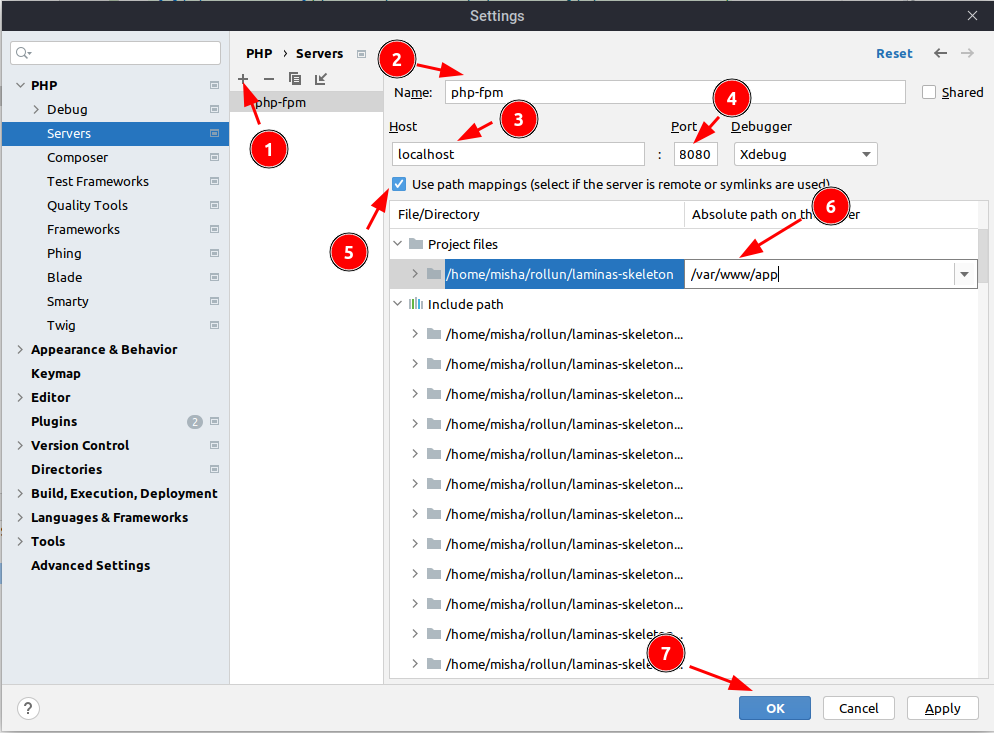
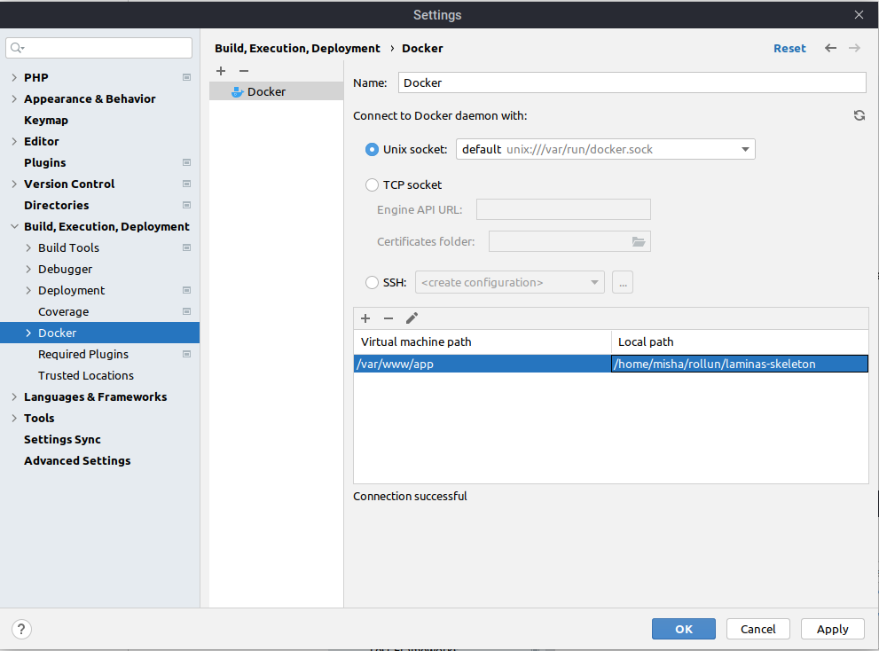

# Початок роботи з проектом

## Розробка за допомогою docker

Для початку у вашій системі повині бути встановлені залежності:
- docker
- docker-compose
- make

### Робота через cli

**Ініціалізація проекта** (повністю пересобирає увесь проект, встановлює бібілотеки і т.п.)

```bash
make init
```

Після чого сервіс повинен бути доступний за посиланням localhost:8080

**Завершення роботи з проектом**

```bash
make down
```

Зупиняє роботу усіх докер контейнерів пов'язанних з сервісом.

**Запуск проекту** (без пересбирання)

```bash
make up
```

Більше корисних команд ви можете знайти у файлі [Makefile](../Makefile)

**Запуск процесу в контейнері**

```bash
docker-compose exec php-fpm {your command}
```

Де {your command} - будь яка cli команда, що виконається всередині контейнеру з php.

Наприклад, це може знадобитись, щоб обновити залежності через composer

```bash
docker-compose exec php-fpm composer update
```

Оскільки файлові системи пов'язані через volume, то будь-яка зміна всередині контейнеру
відображається на host машині (тобто якщо змінити файл в середині контейнеру, то він зміниться і на основній ОС). Але це
стосується тільки папки з застосунком (яка знаходиться в /var/app всередині контейнеру).

## Логгер

Логгер в dev режимі [налаштованний](../config/autoload/logger.global.dev.php), щоб записувати логи в data/logs/all.log

## Налаштування PhpStorm

1. Додайте інтерпретатор
   
   
   
   

2. Налаштуйте composer
   

3. Налаштуйте Xdebug
    
    
    
    

## Локальні конфіги

Локальні конфіги - це ті які не потрабляють в гіт репозиторій, а отже будуть доступні лише на вашій машині.
Для того, щоб створити локальний конфіг достатньо щоб назва файлу конфігу відповідала шаблону `*.local.php`

Також окрім локальних конфігів можна створювати конфіги, що будуть залежати від оточення в якому запущенно сервер, тобто
від змінної оточення APP_ENV (dev, prod, test). Для цього достатньо щоб назва файлу конфігу відповідала шаблону
`{{,*.}global.{$appEnv}.php`, наприклад 'db.global.dev.php' - буде підключенно тільки якщо змінна APP_ENV = dev

## Конфіг для Interrupter

Якщо потрібно юзати Interrupter, то потрібно додати до конфіга 


```php
 return [
            'dependencies' => $this->getDependencies(),
            SerializedCallbackAbstractFactory::class => [
                'SerializedMyCallback' => MyCallback::class,
            ],
            InterruptAbstractFactoryAbstract::KEY => [
                'processInterrupter' => [
                    ProcessAbstractFactory::KEY_CLASS => Process::class,
                    ProcessAbstractFactory::KEY_CALLBACK_SERVICE => 'SerializedMyCallback',
                ],
            ],
        ];
```
Та треба додати до dependencies
``` php
'abstract_factories' => [
    ProcessAbstractFactory::class,
    SerializedCallbackAbstractFactory::class,
],
```

## Конфіг для callback через Plugin Manager

Траба додати поряд з dependencies

``` php
CallablePluginManagerFactory::KEY_INTERRUPTERS => [
    'factories'  => [
        'MyCallback' => UpdateOrderCallbackFactory::class,
    ],
],
```
URL буде такий `/api/webhook/MyCallback`
